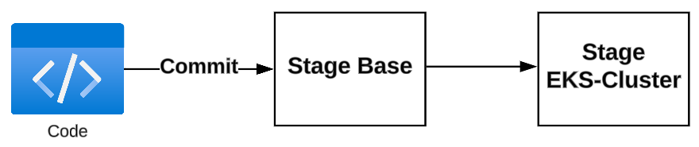
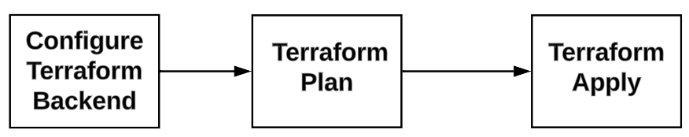
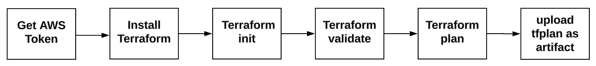
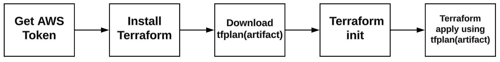

# Smart-Cash Project

This is a personal project to practice some concepts that I have learned during my professional life and to use some tools that I want to learn in a hands-on manner.

A series of blog posts have been published in Dev.to. You can read them and follow the steps outlined:

1. [Infrastructure - Terraform and GitHub Actions](https://dev.to/aws-builders/smartcash-project-infrastructure-terraform-and-github-actions-2bo3)
2. [Implementing GitOps using FluxCD](https://dev.to/aws-builders/smartcash-project-gitops-with-fluxcd-3aep)
3. [Monitoring EKS cluster using Prometheus operator](https://dev.to/aws-builders/adding-monitoring-to-eks-using-prometheus-operator-3ke1)

## Folder structure

This project contains two main folders:

### app folder

Contains the application code. Each service has a subfolder that contains the word **_service_** at the end of the name.Inside this subfolder can be found the Go code and Dockerfile for the service.

The subfoler utils contains Go packages used by microservice code.

### infra folder

Contains the terraform code and the YAML manifest to deploy AWS and Kubernetes resources.

* The **_Kubernetes_** folder contains the YAML files sorted in different subfolders. For more information about how this works,check the blog post [Implementing GitOps using FluxCD](https://dev.to/aws-builders/smartcash-project-gitops-with-fluxcd-3aep).

* The **_terraform_** folder contains the Terraform code to create the AWS resources and push YAML manifest to GitOps repository.

## Infrastructure Deployment

Deployment is devided in two main stages:

1. **base**: This stage deploys the AWS networking needed for the project(VPC,subnets,endpoints, etc) and some resources like KMS keys and IAM roles.
2. **eks-cluster**: This stage deploys the K8 cluster, performs the Flux bootstrap and push the first YAML manifests to GitOps repository to create the core K8 resources needed like, namespaces, FluxCD CRD, etc.

### General workflow

The following diagram shows the general GitHub workflow for infrastructure deployment.This is located in **_./github/workflows/infra-deployment-${ENVIRONMENT}_**.

This is triggered when changes are made in the paths **_infra/terraform/base_** and **_infra/terraform/eks-cluster_**

### Terraform workflow

This executes jobs that run TF Plan and apply, a workflow template has been created to avoid repeating code, this can be found in **_./github/workflows/template-run-terraform_**.

1. **Configure Terraform Backend**: This job executes a bash script located in  **_.github/jobs/terraform-backend.sh_**. This script checks if there is a S3 bucket and a DynamoDB table, if not, it is created, the name of the table depends on the variables passed on the action.

2. **Terraform Plan**: This executes a composite action created to avoid repeating code because these steps are needed in other workflows. This can be found in **_./github/actions/terraform-plan/action.yaml**.The following diagram shows the steps execute by the composite action:

    

3. **Terraform Apply**: This executes a composite action created to avoid repeating code because these steps are needed in other workflows. This can be found in **_./github/actions/terraform-apply/action.yaml_**.The following diagram shows the steps execute by the composite action:

    

## Kubernetes resources creation

GitOps is used to create K8 resources, [Implementing GitOps using FluxCD](https://dev.to/aws-builders/smartcash-project-gitops-with-fluxcd-3aep) explains more details about implementation.
