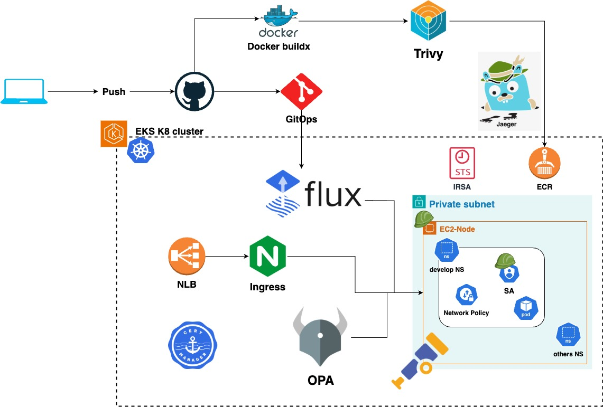

# Smart-Cash Project(Under development)
iiiiii
This is a personal project to test some tools that I want to learn in a hands-on manner.

Here are some blog posts created along this project

- [AWS Infrastructure - Terraform and GitHub Actions](https://dev.to/aws-builders/smartcash-project-infrastructure-terraform-and-github-actions-2bo3)
- [GitOps with FluxCD](https://dev.to/aws-builders/smartcash-project-gitops-with-fluxcd-3aep)
- [Adding monitoring to EKS using Prometheus operator](https://dev.to/aws-builders/adding-monitoring-to-eks-using-prometheus-operator-3ke1)
- [Configuring Logging in AWS EKS Using Fluent Bit and CloudWatch](https://dev.to/aws-builders/configuring-logging-in-aws-eks-using-fluent-bit-and-cloudwatch-1fpb)

## Folder structure

This project contains two main folders:

### app folder

Contains the application code. Each service has its own folder.

utils folder contains Go packages used by microservice code.

### infra folder

Contains the Terraform code and K8 manifests divided by different stages:

* **1-base-stage:** This stage deploys the AWS networking needed for the project(VPC,subnets,endpoints, etc) and some resources like KMS keys and IAM roles.
* **2-eks-cluster-stage:** This stage creates the EKS cluster and deploy the first kubernetes resources like, flux CRD, namespaces, nginx-ingress. This stage defines the core resources for the project.
* **3-k8-common-stage:** This stage deploys k8 and AWS resources that are used for the whole environment.
* **4-workloads-stage:** This stage contains the infrastructure for the services to deploy, each service has its own folder where the TF code is defined based on the infrastructure requirements.

## Infrastructure

### AWS Architecture

### Infrastructure Deployment

Deployment is done per stage, all the stages uses a GitHub workflow template that executes terrafrom. The template can be found in **_./github/workflows/template-run-terraform_**. The following Diagram shows in high level the stages executed.

* The bash script that detect the folders updated and generated the array can be found in **_.github/jobs/detect-folders-updated.sh**
* The bash script to configure the Terraform backend is located in **_.github/jobs/terraform-backend.sh_**. 
* Terraform Plan and Apply have benn configure as a composite action located in **_./github/actions.

## Kubernetes Resources

The following image shows in high level some kubernetes resources used:

The K8 manifest for each stage can be found in a folder named k8-manifests, these are pushed to GitHub by Terraform and FluxCD create/delete them in the Kubernetes cluster.

## CI/CD App

The app folder contains the different services to deploy. Each service has its own Dockerfile that is used to build the image and push it to AWS ECR to be used by the pods.

There is a main workflow that is triggered when new changes are detected in the app folder. The workflow can be found in **_./github/workflows/service-build-push-${ENVIRONMENT}_**.

#### Build process

This calls a workflow tamplate that can be found in **_./github/workflows/template-service-deploy**. The following image shows the steps executed by the template:

1. **Set up Docker Buildx:** This step installs and configures docker Buildx used to build the Docker image.
2. **Build image:** Docker build command is executed iniside the folder name passed in the previous job.
3. **Image security scanning:** Trivy is used as a security scanning tool.
4. **Upload to Github Security report:** The report generated by Trivy is converted to SARIF format and uploaded to Github fo review then.
5. **Validate severity:** If the severity of the vulnerabilities found by Trivy is HIGH or CRITICAL, the pipeline will fail.
6. **Push to AWS ECR:** The image is tagged and pushed to AWS ECR.

## Destroy Process

The destroy process can be done by a GitHub workflow. This must be executed manually, where you can choose which stage to destroy. To avoid dependency errors, please execute the job for the microservices first, then destroy the EKS cluster, and finally the base stage.

The name of the workflow is **_DESTROY INFRASTRUCTURE_**. Inside the workflow, you can choose the branch and the stage to execute.
